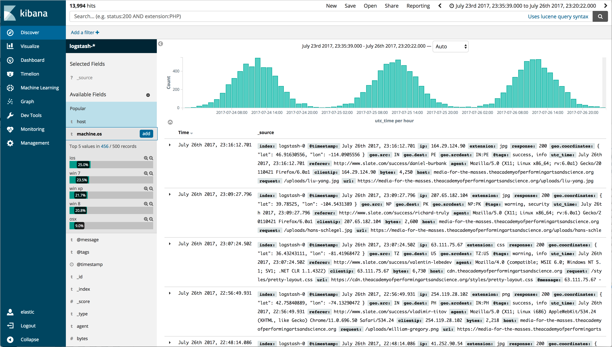

# Logging

Homepage: [https://opendistro.github.io/for-elasticsearch/](https://opendistro.github.io/for-elasticsearch/)

Ansible-NAS uses the Amazon built version of the Elastic stack, known as Open Distro for Elasticsearch. It's the open source version of Elasticsearch bundled with security and alerting. Elastic's Filebeat is used to collect logs.

Together the tools can be used to view all of the logs produced by the applications running in Ansible-NAS.

## Usage

Set `logging_enabled: true` in your `group_vars/all.yml` file.

Kibana can be found at http://ansible_nas_host_or_ip:5601, Elasticsearch's API can be found at https://ansible_nas_host_or_ip:9200.

## Specific Configuration

Once the stack has spun up, you need to create a default index pattern in Kibana:

1. Log into Kibana at http://ansible_nas_host_or_ip:5601
2. Log in with `admin` / `admin`.
3. Click Management > Index Patterns > Create Index Pattern
4. In the box type `filebeat*`, push Next Step.
5. Select `@timestamp` as the Time Filter field name, and push Create Index Pattern.
6. Hit Discover and start viewing some logs!

The default username and password is `admin`, see [here](https://opendistro.github.io/for-elasticsearch-docs/docs/install/docker-security/#change-passwords-for-read-only-users) for instructions how to change it.
